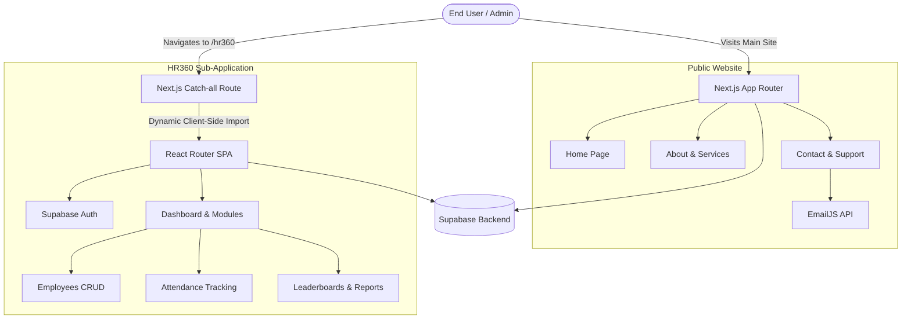

# SBS Prospects

**SBS Prospects** is a comprehensive web platform designed to build careers through industry-focused training. The platform consists of a modern, public-facing marketing website built with Next.js, and a deeply integrated, powerful HR management system (HR360) built as a React Single Page Application (SPA).

---

## 🎯 Project Intent

The primary intent of this project is to provide a seamless digital experience for both prospective candidates and internal human resources teams. 
- **For Candidates & Clients (Public Site):** A modern, fast, and interactive website to explore services, read about the company, and get in touch via contact forms or the integrated chatbot.
- **For HR & Management (HR360):** A centralized, secure portal to manage employee records, attendance, applications, leaderboards, and daily organizational operations.

---

## 🏗️ Architectural Flow

This project utilizes a **Hybrid Architecture** combining Server-Side Rendering (SSR) for SEO and performance on marketing pages, with a Client-Side Rendered (CSR) Single Page Application for the internal HR dashboard.



---

## ✨ Features

### Public Website
- **Modern UI/UX:** Responsive, accessible, and interactive components animated with Framer Motion.
- **SEO Optimized:** Leveraging Next.js App Router for optimal indexing and fast initial load times.
- **Chatbot Integration:** Built-in floating chat widget to assist visitors interactively.
- **Contact Management:** Direct email messaging via EmailJS.

### HR360 (Human Resources Portal)
- **Secure Authentication:** Role-based access utilizing Supabase Auth.
- **Employee Management:** Complete CRUD operations for employee directories.
- **Attendance & Leaderboard:** Track employee presence and measure performance metrics.
- **Operational Modules:** Issue tracking, project assignments, applications, reports generation (via jsPDF/Recharts), and notifications.
- **Mock Mode Fallback:** If Supabase is unconfigured, the HR360 app falls back to a local/mock data mode for easy UI development.

---

## 🛠️ Technology Stack

- **Core:** React 19, Next.js 16 (App Router)
- **Embedded SPA:** React Router v7
- **Styling:** Tailwind CSS v4, PostCSS, Lucide React / React Icons
- **Animations:** Framer Motion, Lenis (Smooth Scrolling)
- **Backend / BaaS:** Supabase (Database, Auth)
- **Utilities:** Axios, jsPDF, Recharts (Data Visualization)

---

## 📂 Folder Structure

```text
sbs-prospects-website/
├── src/
│   ├── app/                 # Next.js App Router (Pages & API routes)
│   │   ├── api/             # Next.js API endpoints
│   │   └── hr360/           # Catch-all route to inject the SPA
│   ├── components/          # Shared Next.js UI components (Sections, Chatbot, Layout)
│   ├── hooks/               # Custom React hooks for the public app
│   ├── hr360-app/           # 🚀 Embedded HR Management React SPA
│   │   ├── components/      # HR360 specific components
│   │   ├── context/         # Auth and App contexts
│   │   ├── pages/           # HR360 Modules (Dashboard, Employees, etc.)
│   │   ├── services/        # Supabase API services
│   │   └── main-next.jsx    # Entry point for the embedded SPA
│   └── lib/                 # Shared utilities and configurations
├── public/                  # Static assets (Images, Fonts, Icons)
├── tailwind.config.ts       # Tailwind CSS configuration
└── next.config.ts           # Next.js configuration
```

---

## 🚀 Getting Started

### Prerequisites
- **Node.js** (v18 or higher recommended)
- **npm**, **yarn**, **pnpm**, or **bun**
- A **Supabase** project for the backend functionalities (optional for mock mode).

### Environment Variables
Create a `.env` file in the root directory and configure the following variables. (Refer to `.env.example`)

```env
# Supabase Configuration (Required for HR360 Production Mode)
NEXT_PUBLIC_SUPABASE_URL=your_supabase_url
NEXT_PUBLIC_SUPABASE_ANON_KEY=your_supabase_anon_key

# Google Service Accounts (If utilizing Google Sheets integrations)
GOOGLE_SERVICE_ACCOUNT_EMAIL=your_service_account_email
GOOGLE_PRIVATE_KEY="your_private_key"
```

> **Note:** If `NEXT_PUBLIC_SUPABASE_URL` and `NEXT_PUBLIC_SUPABASE_ANON_KEY` are left empty, the HR360 portal gracefully falls back to a "local mock mode" for development without a backend.

### Installation

1. Clone the repository and install dependencies:
   ```bash
   npm install
   # or
   yarn install
   ```

2. Run the development server:
   ```bash
   npm run dev
   # or
   yarn dev
   ```

3. Open [http://localhost:3000](http://localhost:3000) with your browser to see the public site. Navigate to [http://localhost:3000/hr360](http://localhost:3000/hr360) to access the HR360 portal.

---

## 📜 Scripts

- `npm run dev`: Starts the Next.js development server.
- `npm run build`: Creates an optimized production build.
- `npm run start`: Starts the production server.
- `npm run lint`: Runs ESLint for code quality checks.
